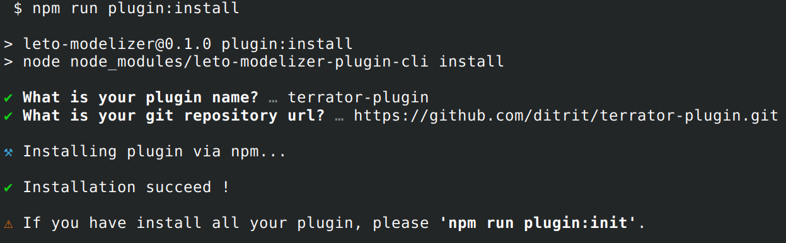
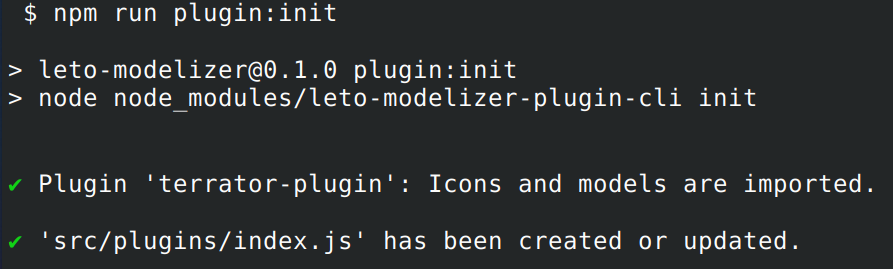

# Leto Modelizer (leto-modelizer)

[](https://sonarcloud.io/summary/overall?id=ditrit_leto-modelizer)
[](https://sonarcloud.io/summary/overall?id=ditrit_leto-modelizer)
[](https://sonarcloud.io/summary/overall?id=ditrit_leto-modelizer)
[](https://sonarcloud.io/summary/overall?id=ditrit_leto-modelizer)

[](https://sonarcloud.io/summary/overall?id=ditrit_leto-modelizer)
[](https://sonarcloud.io/summary/overall?id=ditrit_leto-modelizer)
[](https://sonarcloud.io/summary/overall?id=ditrit_leto-modelizer)
[](https://sonarcloud.io/summary/overall?id=ditrit_leto-modelizer)

[](https://sonarcloud.io/summary/overall?id=ditrit_leto-modelizer)
[](https://sonarcloud.io/summary/overall?id=ditrit_leto-modelizer)
[](https://sonarcloud.io/summary/overall?id=ditrit_leto-modelizer)

Technical topology low-code editing tool.

Leto modelizer is an application that can help you to generate infrastructure code without you to have written any code!
One of theirs principales qualities is that you can choose:


- which languages you can provide with this application

Or

- Implements your own plugin

Or

- Override existing plugins

If your company take care only of terraform files, you just have to install terraform before build this app and deploy it.

If you want only our own language component (maybe based on existing plugins), you can implement/override existing plugin.
And just install your plugin definition.

## How to install plugin

Make an `npm install` to let npm retrieve all dependencies and specially our cli to install easily your plugins 😉.

Then you just have to know two things about your plugins:
- it's name
- it's repository url

Let us show you how our cli works with TerraformPlugin:

run this command: `npm run plugin:install`



Now your plugin is installed, you can continue to install other plugin with the same command if you want.

When you install all your wanted plugins, please run this commands `npm run plugin:init` to finalise all plugins' installation.



## How to build this app

Once you have installed and initialized all yours plugins, run this commands to build the app:

```
npm run build
```

It will generate the built application in the `dist` folder.

## Official plugins

For now, we don't have much plugin to propose to you, but follow us and in the next (few) months you will see new plugins (like Jenkins or Kubernetes).

### Terraform plugin

Plugin to manage terraform files, by default it come from with aws provider definition.

[GitHub url](https://github.com/ditrit/terrator-plugin)

Option to use it in command `install`:

- plugin name: `terrator-plugin`
- repository url: `https://github.com/ditrit/terrator-plugin.git#0.1.3`


