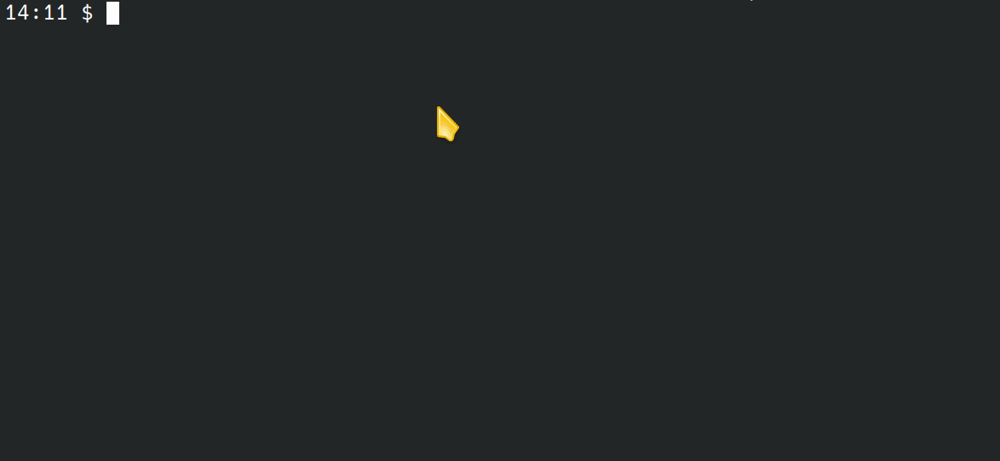

# Leto Modelizer (leto-modelizer)

[](https://sonarcloud.io/summary/overall?id=ditrit_leto-modelizer)
[](https://sonarcloud.io/summary/overall?id=ditrit_leto-modelizer)
[](https://sonarcloud.io/summary/overall?id=ditrit_leto-modelizer)
[](https://sonarcloud.io/summary/overall?id=ditrit_leto-modelizer)

[](https://sonarcloud.io/summary/overall?id=ditrit_leto-modelizer)
[](https://sonarcloud.io/summary/overall?id=ditrit_leto-modelizer)
[](https://sonarcloud.io/summary/overall?id=ditrit_leto-modelizer)
[](https://sonarcloud.io/summary/overall?id=ditrit_leto-modelizer)

[](https://sonarcloud.io/summary/overall?id=ditrit_leto-modelizer)
[](https://sonarcloud.io/summary/overall?id=ditrit_leto-modelizer)
[](https://sonarcloud.io/summary/overall?id=ditrit_leto-modelizer)

[](https://discord.gg/zkKfj9gj2C)


Technical topology low-code editing tool.

Leto modelizer is an application that can help you generate infrastructure code without you having to write any code!
One of theirs main qualities is that you can choose:


- which languages you can provide with this application

Or

- Implements your own plugin

Or

- Override existing plugins

If your company take care only of terraform files, you just have to install terraform before build this app and deploy it.

If you only want your own language component (maybe based on existing plugins), you can implement/override existing plugin and just install your plugin definition.

## Requirements

* node - [v18.4](https://nodejs.org/en/blog/release/v18.4.0)
* npm - [v8.19.3](https://www.npmjs.com/package/npm/v/8.19.3)

## Official plugins

For now, we don't have many plugins to offer you, but follow us and in the next (few) months you will see new plugins (like Jenkins or Kubernetes).

### Terraform plugin

Plugin to manage terraform files, by default it comes with aws provider definition.

[GitHub url](https://github.com/ditrit/terrator-plugin#0.3.0)

### Github plugin

Plugin to manage github action files.

[GitHub url](https://github.com/ditrit/githubator-plugin#0.2.0)

## Compatibility versions table

<table>
  <thead>
    <tr>
      <th rowspan="2">Leto-modelizer</th>
      <th colspan="3">Supported version</th>
    </tr>
    <tr>
      <th>Plugin-core</th>
      <th>Terrator-plugin</th>
      <th>Githubator-plugin</th>
    </tr>
  </thead>
  <tbody>
    <tr>
      <td>1.0.0</td>
      <td>= 0.13.0<br>= 0.14.0</br></td>
      <td>= 0.1.12</td>
      <td>🚫</td>
    </tr>
    <tr>
      <td>1.1.0</td>
      <td>= 0.15.2</td>
      <td>= 0.2.0</td>
      <td>= 0.1.1</td>
    </tr>
    <tr>
      <td>next version</td>
      <td>= 0.16.0</td>
      <td>= 0.3.0</td>
      <td>= 0.2.0</td>
    </tr>
  </tbody>
</table>

## How to install plugin

Run `npm install` to let npm retrieve all dependencies and especially our cli to easily install your plugins 😉.

Then you just have to know two things about your plugins:
- it's name
- it's repository url

To install plugin, run this command `npm run plugin:install`.
You can choose between installing __official__ or __custom__ plugins.

### Install official plugins

The `leto-modelizer-plugin-cli.json` file, at the root of Leto Modelizer, contains the list of official plugins provided by the team. Each plugin is represented by an object containing the name, repository URL and version of the plugin.

Choose __Official plugins__ to select from the list of official plugins, one or more plugin(s) to install.



### Install custom plugin

Choose __Custom plugin__ to install a specific plugin not referenced as an official plugin.


Examples with official plugins:
- terrator-plugin: 
  - plugin name: `terrator-plugin`
  - git repository url: `https://github.com/ditrit/terrator-plugin.git#0.3.0`
- githubator-plugin: 
  - plugin name: `githubator-plugin`
  - git repository url: `https://github.com/ditrit/githubator-plugin.git#0.2.0`

### Install custom plugin in command line

Options `repository-name` and `repository-url` can be added with the `npm run plugin:install` command to bypass cli prompts.

```bash
# Example with terraform plugin
npm run plugin:install -- repository-name="terrator-plugin" repository-url="https://github.com/ditrit/terrator-plugin.git#0.3.0"

# Example with github action plugin
npm run plugin:install -- repository-name="githubator-plugin" repository-url="https://github.com/ditrit/githubator-plugin.git#0.2.0"
```

Now that your plugin is installed, you can continue to install other plugins with the same command if you want.

### Initialize plugins


When you have installed all the desired plugins, please run this commands `npm run plugin:init` to complete all plugins' installation.


## How to build this app

### Native build

Once you have installed and initialized all your plugins, run this command to build the app:

```
npm run build
```

It will generate the built application in the `dist` folder.

### Docker build

To build this app with docker, please use this command:
```bash
docker build . --build-arg proxy_url=http://localhost:9999 -t leto-modelizer
```

### Proxy

See [nginx configuration](nginx.conf).

### Environment variables

* Define the default path for your models

`MODELS_DEFAULT_FOLDER` is used to define the path of the default folder in which the different plugins and models folders will be located.
By default, the path will be `[root_project]/[plugin]/[model]/[file]`.

For example, if you want the default models folder to be `YOUR_FOLDER`, the path will be `[root_project]/YOUR_FOLDER/[plugin]/[model]/[file]`.
You can also have multiple level by adding a `/` between each name like `YOUR_FOLDER/test/example`. (Warning: Do not add any `/` at the beginning or the end).

To define it :

```bash
MODELS_DEFAULT_FOLDER="YOUR_FOLDER" npm run build
```

* Using templates from a remote repository

`TEMPLATE_LIBRARY_BASE_URL` is used to define the url of a template library you want to use. To have more information on how to build your own template library, please visit [leto-modelizer-templates-library](https://github.com/ditrit/leto-modelizer-templates-library). To define `TEMPLATE_LIBRARY_BASE_URL`, go to your repository, open the `index.json` file (which contains all the metadata of your templates) in raw mode and get the url to the branch name, without including the file name.


```bash
# Example with the leto-modelizer-templates-library repository that contains all default templates for leto-modelizer.
TEMPLATE_LIBRARY_BASE_URL="https://raw.githubusercontent.com/ditrit/leto-modelizer-templates-library/main" npm run build
```

To be able to access external resources for your templates, you need to set a reverse proxy named `template-library`. You can see an example below of an `nginx.conf` file:

```bash
http {
  server {
    listen 80;
    location /template-library {
      proxy_pass TEMPLATE_LIBRARY_BASE_URL; # replace by your url
    }
  }
}
```

* Allow to keep `data-cy` attribute in html

`KEEP_CYPRESS_ATTRIBUTE` is used to keep all `data-cy` attribute in the generated html.

```bash
KEEP_CYPRESS_ATTRIBUTE=true npm run build
```
